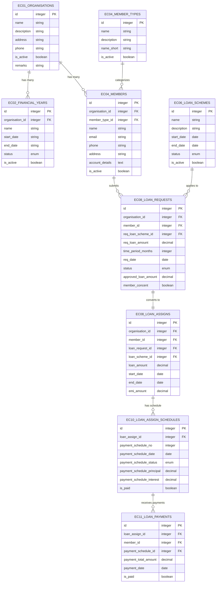

# CoopSolutions Database Analysis & UI/UX Design Guide

## Table of Contents

1. [Database Schema Overview](#database-schema-overview)
2. [Table Dependencies & Relationships](#table-dependencies--relationships)
3. [Data Entry Sequence Architecture](#data-entry-sequence-architecture)
4. [UI/UX Design Recommendations](#uiux-design-recommendations)
5. [CRUD Operation Patterns](#crud-operation-patterns)
6. [Best Practices & Guidelines](#best-practices--guidelines)

---

## Database Schema Overview

The CoopSolutions system follows a modular architecture with prefix-based naming conventions:

-   **EC** (Entity Core): Core business entities (organizations, members, loans, funds)
-   **WF** (Workflow): Task and process management
-   **TB** (Table): Role and permission management

### Core Entity Relationships Diagram



---

## Table Dependencies & Relationships

### Foundation Layer (Level 1)

**Independent Tables - No Dependencies**

#### EC01_ORGANISATIONS

-   **Purpose**: Root entity for all organizational data
-   **Key Fields**: `id`, `name`, `address`, `phone`, `is_active`
-   **Dependencies**: None
-   **Dependents**: All other tables (directly or indirectly)

#### EC04_MEMBER_TYPES

-   **Purpose**: Member categorization (Regular, Premium, VIP, etc.)
-   **Key Fields**: `id`, `name`, `name_short`, `is_active`
-   **Dependencies**: None
-   **Dependents**: `EC04_MEMBERS`

#### EC06_LOAN_SCHEMES

-   **Purpose**: Loan product definitions
-   **Key Fields**: `id`, `name`, `start_date`, `end_date`, `status`
-   **Dependencies**: None
-   **Dependents**: `EC08_LOAN_REQUESTS`, `EC08_LOAN_ASSIGNS`

#### USERS

-   **Purpose**: System user authentication
-   **Key Fields**: `id`, `name`, `email`, `password`
-   **Dependencies**: None
-   **Dependents**: All workflow and transaction tables

#### ROLES

-   **Purpose**: User role definitions
-   **Key Fields**: `id`, `name`, `guard_name`
-   **Dependencies**: None
-   **Dependents**: `TB02_ROLE_OPERATIONS`

### Core Entity Layer (Level 2)

**Tables with Single Dependencies**

#### EC02_FINANCIAL_YEARS

-   **Purpose**: Organizational financial year management
-   **Key Fields**: `id`, `organisation_id`, `name`, `start_date`, `end_date`, `status`
-   **Dependencies**: `EC01_ORGANISATIONS` (organisation_id)
-   **Dependents**: All financial transaction tables

#### EC04_MEMBERS

-   **Purpose**: Member master data
-   **Key Fields**: `id`, `organisation_id`, `member_type_id`, `name`, `email`, `phone`
-   **Dependencies**:
    -   `EC01_ORGANISATIONS` (organisation_id)
    -   `EC04_MEMBER_TYPES` (member_type_id)
-   **Dependents**: All member-related transactions

#### WF01_TASK_CATEGORIES

-   **Purpose**: Workflow task categorization
-   **Key Fields**: `id`, `organisation_id`, `name`, `description`
-   **Dependencies**: `EC01_ORGANISATIONS` (organisation_id)
-   **Dependents**: `WF03_TASK_EVENTS`

### Transaction Layer (Level 3)

**Tables with Multiple Dependencies**

#### EC08_LOAN_REQUESTS

-   **Purpose**: Member loan applications
-   **Key Fields**: `id`, `organisation_id`, `member_id`, `req_loan_scheme_id`, `req_loan_amount`, `status`
-   **Dependencies**:
    -   `EC01_ORGANISATIONS` (organisation_id)
    -   `EC04_MEMBERS` (member_id)
    -   `EC06_LOAN_SCHEMES` (req_loan_scheme_id)
-   **Dependents**: `EC08_LOAN_ASSIGNS`

#### EC08_LOAN_ASSIGNS

-   **Purpose**: Approved loan assignments
-   **Key Fields**: `id`, `organisation_id`, `member_id`, `loan_request_id`, `loan_scheme_id`, `loan_amount`
-   **Dependencies**:
    -   `EC01_ORGANISATIONS` (organisation_id)
    -   `EC04_MEMBERS` (member_id)
    -   `EC08_LOAN_REQUESTS` (loan_request_id)
    -   `EC06_LOAN_SCHEMES` (loan_scheme_id)
-   **Dependents**: `EC10_LOAN_ASSIGN_SCHEDULES`, `EC11_LOAN_PAYMENTS`

### Schedule & Payment Layer (Level 4)

**Complex Interdependent Tables**

#### EC10_LOAN_ASSIGN_SCHEDULES

-   **Purpose**: EMI schedule generation
-   **Key Fields**: `id`, `loan_assign_id`, `payment_schedule_no`, `payment_schedule_date`, `payment_schedule_principal`, `payment_schedule_interest`
-   **Dependencies**: `EC08_LOAN_ASSIGNS` (loan_assign_id)
-   **Dependents**: `EC11_LOAN_PAYMENTS`

#### EC11_LOAN_PAYMENTS

-   **Purpose**: Actual loan payment records
-   **Key Fields**: `id`, `loan_assign_id`, `member_id`, `payment_schedule_id`, `payment_total_amount`, `payment_date`
-   **Dependencies**:
    -   `EC08_LOAN_ASSIGNS` (loan_assign_id)
    -   `EC04_MEMBERS` (member_id)
    -   `EC10_LOAN_ASSIGN_SCHEDULES` (payment_schedule_id)

### Fund Management Tables

#### EC15_THFUND_TRANSACTIONS (Thrift Fund)

-   **Purpose**: Member thrift fund deposits/withdrawals
-   **Key Fields**: `id`, `member_id`, `transaction_type`, `transaction_amount`, `transaction_date`
-   **Dependencies**:
    -   `EC04_MEMBERS` (member_id)
    -   `EC01_ORGANISATIONS` (organisation_id)
    -   `EC02_FINANCIAL_YEARS` (financial_year_id)

#### EC16_SHFUND_MEMBER_TRANSACTIONS (Share Fund - Member)

-   **Purpose**: Member share fund transactions
-   **Key Fields**: `id`, `member_id`, `transaction_type`, `transaction_amount`
-   **Dependencies**: Similar to thrift fund

#### EC17_SHFUND_BANK_TRANSACTIONS (Share Fund - Bank)

-   **Purpose**: Bank share fund transactions
-   **Key Fields**: `id`, `bank_id`, `transaction_type`, `transaction_amount`
-   **Dependencies**: `EC20_BANKS` (bank_id)

### Bank Integration Tables

#### EC20_BANKS

-   **Purpose**: Bank master data
-   **Key Fields**: `id`, `name`, `organisation_id`, `financial_year_id`
-   **Dependencies**:
    -   `EC01_ORGANISATIONS` (organisation_id)
    -   `EC02_FINANCIAL_YEARS` (financial_year_id)

#### EC21_BANK_LOAN_SCHEMES

-   **Purpose**: Bank loan products
-   **Key Fields**: `id`, `bank_id`, `name`, `organisation_id`, `financial_year_id`
-   **Dependencies**: Multiple (bank_id, organisation_id, financial_year_id)

---

## Data Entry Sequence Architecture

Based on the memory knowledge of the four-phase data entry sequence pattern:

### Phase 1: Foundation Setup (Must Complete First)

```
1. EC01_ORGANISATIONS (Root setup)
2. EC02_FINANCIAL_YEARS (Time periods)
3. USERS & ROLES (System access)
4. EC04_MEMBER_TYPES (Member categories)
5. EC06_LOAN_SCHEMES (Loan products)
```

### Phase 2: Core Entities (Unlock after Phase 1)

```
1. EC04_MEMBERS (Member registration)
2. EC20_BANKS (Bank setup)
3. WF01_TASK_CATEGORIES (Workflow setup)
```

### Phase 3: Transactions (Unlock after Phase 2)

```
1. EC08_LOAN_REQUESTS (Loan applications)
2. EC08_LOAN_ASSIGNS (Loan approvals)
3. EC15_THFUND_TRANSACTIONS (Thrift deposits)
4. EC16_SHFUND_MEMBER_TRANSACTIONS (Share transactions)
5. EC21_BANK_LOAN_SCHEMES (Bank products)
```

### Phase 4: Advanced Operations (Unlock after Phase 3)

```
1. EC10_LOAN_ASSIGN_SCHEDULES (EMI schedules)
2. EC11_LOAN_PAYMENTS (Loan payments)
3. WF03_TASK_EVENTS (Workflow execution)
4. Complex reporting and analytics
```

---

## UI/UX Design Recommendations

### 1. Progressive Menu Disclosure Pattern

```
┌─ Foundation Setup ──────────────────┐
│ ✓ Organisation Setup               │ ← Always available
│ ✓ Financial Years                  │ ← Unlocked after org
│ ✓ User Management                  │ ← Unlocked after org
│ ✓ Member Types                     │ ← Unlocked after org
│ ✓ Loan Schemes                     │ ← Unlocked after org
└────────────────────────────────────┘

┌─ Core Entities ─────────────────────┐
│ 🔒 Members (Unlock after Phase 1)   │ ← Disabled until foundation complete
│ 🔒 Banks (Unlock after Phase 1)     │
│ 🔒 Workflow Categories              │
└────────────────────────────────────┘

┌─ Transactions ──────────────────────┐
│ 🔒 Loan Applications               │ ← Disabled until members exist
│ 🔒 Fund Transactions               │
│ 🔒 Bank Loan Products              │
└────────────────────────────────────┘
```

### 2. Compact Dashboard Design

#### Main Dashboard Layout

```
┌─────────────────────────────────────────────────────────────┐
│ COOPSOLUTIONS                                    Profile ▼ │
├─────────────────────────────────────────────────────────────┤
│                                                             │
│ ┌─ Setup Progress ─────┐  ┌─ Quick Actions ─────────────┐ │
│ │ Foundation:    ✓ 5/5 │  │ [+ New Member]              │ │
│ │ Core Entities: ✓ 3/3 │  │ [+ Loan Application]        │ │
│ │ Transactions:  🔶 2/4 │  │ [+ Fund Transaction]        │ │
│ │ Advanced:      🔒 0/3 │  │ [📊 Reports]                │ │
│ └──────────────────────┘  └─────────────────────────────┘ │
│                                                             │
│ ┌─ Recent Activity ──────────────────────────────────────┐ │
│ │ • John Doe submitted loan application #LA001          │ │
│ │ • Thrift transaction ₹5,000 by Member #M045          │ │
│ │ • EMI payment received from Sarah Johnson             │ │
│ │ • New member registration pending approval            │ │
│ └───────────────────────────────────────────────────────┘ │
└─────────────────────────────────────────────────────────────┘
```

### 3. Modal-Based CRUD Operations

#### Master-Detail Pattern for Tables

```
┌─ Members Management ──────────────────────────────────────┐
│ [+ Add Member] [🔍 Search] [📊 Export] [⚙️ Bulk Actions] │
├─────────────────────────────────────────────────────────────┤
│ Name          │ Type     │ Phone       │ Status │ Actions │
│ John Doe      │ Regular  │ 9876543210 │ Active │ [E][V] │
│ Sarah Johnson │ Premium  │ 9876543211 │ Active │ [E][V] │
│ Mike Wilson   │ Regular  │ 9876543212 │ Inactive│ [E][V] │
└─────────────────────────────────────────────────────────────┘

Modal for Add/Edit Member:
┌─ Add New Member ─────────────────────┐
│ [×]                                  │
│                                      │
│ Personal Information                 │
│ Name: [________________]             │
│ Type: [Regular        ▼]             │
│ Email:[________________]             │
│ Phone:[________________]             │
│                                      │
│ Bank Details                         │
│ Bank: [________________]             │
│ Account:[________________]           │
│ IFSC: [________________]             │
│                                      │
│          [Cancel] [Save Member]      │
└──────────────────────────────────────┘
```

### 4. Smart Form Design

#### Loan Application Form (Multi-Step)

```
Step 1: Basic Information
┌─────────────────────────────────────┐
│ Member Selection                    │
│ Member: [Select Member       ▼]    │ ← Auto-populate details
│ Name: John Doe (auto-filled)       │
│ Type: Regular Member (auto-filled) │
└─────────────────────────────────────┘

Step 2: Loan Details
┌─────────────────────────────────────┐
│ Loan Scheme: [Personal Loan  ▼]    │ ← Show available schemes
│ Amount: [₹ ____________] Max: ₹50k  │ ← Show limits dynamically
│ Period: [12] months                 │
│ Expected EMI: ₹4,583 (calculated)  │ ← Real-time calculation
└─────────────────────────────────────┘

Step 3: Review & Submit
┌─────────────────────────────────────┐
│ Application Summary                 │
│ • Member: John Doe (#M001)         │
│ • Scheme: Personal Loan            │
│ • Amount: ₹50,000                  │
│ • Period: 12 months                │
│ • EMI: ₹4,583                      │
│                                    │
│ [← Back] [Submit Application →]    │
└─────────────────────────────────────┘
```

### 5. Relationship-Aware Data Entry

#### Smart Cascading Dropdowns

```
Organisation: [Sunrise Cooperative ▼]
    ↓ (Auto-filter)
Financial Year: [2023-24 ▼] (Only years for selected org)
    ↓ (Auto-filter)
Member: [Select Member ▼] (Only members in org + year)
    ↓ (Auto-populate)
Member Details: John Doe | Regular | Active
```

#### Validation with Business Rules

```
┌─ Loan Application Validation ────────┐
│ ⚠️ Validation Errors:                │
│                                      │
│ • Member has 2 active loans (Max: 3) │
│ • Requested amount exceeds 80% of    │
│   member's monthly income            │
│ • Member's last payment is overdue   │
│   by 15 days                         │
│                                      │
│ [Fix Issues] [Override (Admin)]      │
└──────────────────────────────────────┘
```

### 6. Efficient Data Display

#### Card-Based Summary Views

```
┌─ Member Dashboard: John Doe ─────────────────────────────┐
│                                                          │
│ ┌─ Active Loans ─┐ ┌─ Thrift Fund ─┐ ┌─ Share Fund ──┐ │
│ │ Count: 2       │ │ Balance: ₹25k │ │ Balance: ₹10k │ │
│ │ Total: ₹1.2L   │ │ Last: +₹2k    │ │ Last: +₹1k    │ │
│ │ Next EMI: 15th │ │ (15 Jan)      │ │ (10 Jan)      │ │
│ └────────────────┘ └───────────────┘ └───────────────┘ │
│                                                          │
│ ┌─ Recent Transactions ──────────────────────────────┐   │
│ │ 15 Jan | EMI Payment      │ ₹8,500  │ ✓ Success  │   │
│ │ 12 Jan | Thrift Deposit   │ ₹2,000  │ ✓ Success  │   │
│ │ 10 Jan | Share Purchase   │ ₹1,000  │ ✓ Success  │   │
│ └────────────────────────────────────────────────────┘   │
└──────────────────────────────────────────────────────────┘
```

### 7. Workflow-Aware Status Management

#### Task-Based Approval Process

```
┌─ Loan Application #LA001 ────────────────────────────────┐
│ Status: Pending Approval                                 │
│ ┌────────────────────────────────────────────────────┐   │
│ │ Workflow Progress                                  │   │
│ │ ✓ Application Submitted    (15 Jan, 10:30 AM)     │   │
│ │ ✓ Initial Verification     (15 Jan, 02:15 PM)     │   │
│ │ 🔶 Manager Approval        (In Progress...)        │   │
│ │ ⏸️ Committee Review        (Pending)               │   │
│ │ ⏸️ Final Disbursement      (Pending)               │   │
│ └────────────────────────────────────────────────────┘   │
│                                                          │
│ Assigned To: Manager Sarah                               │
│ Due Date: 18 Jan 2024                                   │
│ [Add Comment] [Approve] [Reject] [Reassign]             │
└──────────────────────────────────────────────────────────┘
```

---

## CRUD Operation Patterns

### 1. Create Operations

#### Pattern A: Simple Master Data

```typescript
// For tables like EC04_MEMBER_TYPES, EC06_LOAN_SCHEMES
const createPattern = {
    form: "Single-step modal",
    validation: "Real-time field validation",
    feedback: "Toast notification + table refresh",
    redirect: false,
};
```

#### Pattern B: Complex Entities

```typescript
// For tables like EC04_MEMBERS, EC08_LOAN_REQUESTS
const createPattern = {
    form: "Multi-step wizard or collapsible sections",
    validation: "Step-wise validation + business rules",
    feedback: "Progress indicator + confirmation modal",
    redirect: "to detail view or stay in list",
};
```

### 2. Read Operations

#### List Views with Advanced Filtering

```typescript
const listViewFeatures = {
    pagination: "Server-side with 25/50/100 per page",
    sorting: "Multi-column with visual indicators",
    filtering: {
        quickFilters: ["Active/Inactive", "Status", "Date Range"],
        advancedSearch: "Modal with relationship-aware filters",
        savedFilters: "User-specific filter presets",
    },
    bulkActions: ["Export", "Status Change", "Delete"],
    responsiveColumns: "Auto-hide less important columns on mobile",
};
```

#### Detail Views with Related Data

```typescript
const detailViewPattern = {
    layout: "Master-detail with tabs",
    tabs: [
        "Overview",
        "Related Records",
        "Transaction History",
        "Documents",
        "Audit Trail",
    ],
    actions: ["Edit", "Delete", "Clone", "Export", "Print"],
};
```

### 3. Update Operations

#### In-Line Editing for Simple Fields

```html
<!-- For status changes and simple updates -->
<tr>
    <td>John Doe</td>
    <td>
        <select class="inline-edit" data-field="status" data-id="123">
            <option value="active" selected>Active</option>
            <option value="inactive">Inactive</option>
        </select>
    </td>
    <td>✓ Auto-saved</td>
</tr>
```

#### Modal-Based Editing for Complex Data

```html
<!-- Same modal as create, pre-populated with existing data -->
<div class="modal-content">
    <div class="modal-header">
        <h3>Edit Member: John Doe</h3>
        <div class="edit-actions">
            <button class="btn-secondary">View History</button>
            <button class="btn-danger">Delete</button>
        </div>
    </div>
    <!-- Form fields pre-populated -->
</div>
```

### 4. Delete Operations

#### Soft Delete with Recovery

```typescript
const deletePattern = {
    confirmation: "Two-step confirmation with impact warning",
    type: "Soft delete with 30-day recovery period",
    cascade: "Show dependent records that will be affected",
    permissions: "Role-based delete permissions",
    audit: "Log deletion with reason and user",
};
```

#### Cascade Delete Warning

```html
<div class="delete-warning">
    <h4>⚠️ Delete Confirmation</h4>
    <p>Deleting <strong>John Doe</strong> will affect:</p>
    <ul>
        <li>2 Active Loan Applications (will be cancelled)</li>
        <li>15 Thrift Fund Transactions (will be archived)</li>
        <li>3 Pending EMI Payments (will need reassignment)</li>
    </ul>
    <p>Type <code>DELETE JOHN DOE</code> to confirm:</p>
    <input type="text" placeholder="Type confirmation..." />
    <div class="actions">
        <button class="btn-secondary">Cancel</button>
        <button class="btn-danger" disabled>Delete Permanently</button>
    </div>
</div>
```

---

## Best Practices & Guidelines

### 1. Data Integrity Principles

#### Referential Integrity Enforcement

-   **Foreign Key Constraints**: Enable at database level for all relationships
-   **Cascade Rules**: Define appropriate CASCADE/RESTRICT rules
-   **Orphan Prevention**: UI should prevent creation of orphaned records
-   **Data Validation**: Implement validation at both client and server levels

#### Business Rule Validation

```php
// Example: Loan amount validation
class LoanRequestValidation {
    public function validateLoanAmount($memberId, $amount, $schemeId) {
        $member = Member::find($memberId);
        $scheme = LoanScheme::find($schemeId);

        // Check member eligibility
        if (!$member->isEligibleForLoan()) {
            throw new ValidationException('Member not eligible for loans');
        }

        // Check scheme limits
        if ($amount > $scheme->max_amount) {
            throw new ValidationException('Amount exceeds scheme limit');
        }

        // Check existing loan exposure
        $existingLoans = $member->activeLoans()->sum('loan_amount');
        if (($existingLoans + $amount) > $member->creditLimit()) {
            throw new ValidationException('Total loan exposure exceeds credit limit');
        }

        return true;
    }
}
```

### 2. Performance Optimization

#### Database Query Optimization

-   **Eager Loading**: Use `with()` for related data to prevent N+1 queries
-   **Indexing Strategy**: Create composite indexes on frequently queried foreign keys
-   **Pagination**: Implement cursor-based pagination for large datasets
-   **Caching**: Cache frequently accessed master data (organizations, schemes)

#### Frontend Performance

-   **Lazy Loading**: Load related data on-demand in tabs
-   **Virtual Scrolling**: For large lists (>1000 records)
-   **Debounced Search**: 300ms delay for search inputs
-   **Image Optimization**: Compress and resize profile images

### 3. Security Considerations

#### Access Control Matrix

```typescript
const permissions = {
    "organisation.admin": ["*"], // Full access
    manager: [
        "members.view",
        "members.create",
        "members.update",
        "loans.view",
        "loans.approve",
        "loans.reject",
    ],
    clerk: [
        "members.view",
        "members.create",
        "transactions.view",
        "transactions.create",
    ],
    member: ["own.profile.view", "own.loans.view", "own.transactions.view"],
};
```

#### Data Protection

-   **PII Encryption**: Encrypt sensitive fields (Aadhar, PAN, bank details)
-   **Audit Logging**: Track all data modifications with user and timestamp
-   **Field-Level Security**: Hide sensitive data based on user roles
-   **Session Management**: Implement secure session handling

### 4. User Experience Guidelines

#### Responsive Design Breakpoints

```css
/* Mobile First Approach */
.data-table {
    /* Mobile: Stack cards vertically */
    @media (max-width: 768px) {
        .table-row {
            display: block;
            margin-bottom: 1rem;
        }
        .less-important {
            display: none;
        }
    }

    /* Tablet: Show essential columns */
    @media (min-width: 769px) and (max-width: 1024px) {
        .optional-column {
            display: none;
        }
    }

    /* Desktop: Full table view */
    @media (min-width: 1025px) {
        .all-columns {
            display: table-cell;
        }
    }
}
```

#### Loading States and Feedback

```html
<!-- Skeleton Loading for Tables -->
<div class="skeleton-table">
    <div class="skeleton-row">
        <div class="skeleton-cell"></div>
        <div class="skeleton-cell"></div>
        <div class="skeleton-cell"></div>
    </div>
    <!-- Repeat for multiple rows -->
</div>

<!-- Progress Indicators for Forms -->
<div class="form-progress">
    <div class="step active">1. Basic Info</div>
    <div class="step">2. Loan Details</div>
    <div class="step">3. Review</div>
</div>

<!-- Real-time Validation Feedback -->
<div class="field-group">
    <input type="email" class="valid" />
    <div class="validation-feedback success">✓ Valid email address</div>
</div>
```

### 5. Error Handling & Recovery

#### Graceful Error Management

```typescript
const errorHandling = {
    validation: {
        strategy: "Show errors inline with field highlighting",
        timing: "On blur for individual fields, on submit for form",
        grouping: "Group related errors together",
    },

    server: {
        strategy: "Toast notifications with retry options",
        categories: ["Network", "Permission", "Business Rule", "System"],
        recovery: "Auto-retry for network errors, manual for others",
    },

    data: {
        strategy: "Optimistic updates with rollback on failure",
        persistence: "Save draft data in localStorage",
        conflict: "Show merge dialog for concurrent edits",
    },
};
```

### 6. Accessibility (A11y) Standards

#### WCAG 2.1 AA Compliance

-   **Keyboard Navigation**: Full keyboard accessibility for all interactions
-   **Screen Reader Support**: Proper ARIA labels and roles
-   **Color Contrast**: Minimum 4.5:1 ratio for text
-   **Focus Management**: Clear focus indicators and logical tab order

#### Implementation Examples

```html
<!-- Accessible Data Table -->
<table role="table" aria-label="Members List">
    <thead>
        <tr>
            <th scope="col" aria-sort="ascending">
                <button aria-label="Sort by Name">Name ↑</button>
            </th>
            <th scope="col">Phone</th>
            <th scope="col">Status</th>
        </tr>
    </thead>
    <tbody>
        <tr>
            <td>John Doe</td>
            <td>9876543210</td>
            <td>
                <span class="status active" aria-label="Status: Active">
                    Active
                </span>
            </td>
        </tr>
    </tbody>
</table>

<!-- Accessible Modal -->
<div role="dialog" aria-modal="true" aria-labelledby="modal-title">
    <h2 id="modal-title">Add New Member</h2>
    <form>
        <label for="member-name">Full Name *</label>
        <input
            id="member-name"
            type="text"
            required
            aria-describedby="name-help"
        />
        <div id="name-help" class="help-text">
            Enter member's full legal name
        </div>
    </form>
</div>
```

---

## Implementation Roadmap

### Phase 1: Foundation UI (Week 1-2)

1. Implement progressive menu disclosure
2. Create base modal components
3. Setup form validation framework
4. Implement responsive data tables

### Phase 2: Core CRUD Operations (Week 3-4)

1. Organisation and Financial Year management
2. Member Type and Member management
3. Loan Scheme management
4. Basic reporting dashboard

### Phase 3: Transaction Management (Week 5-6)

1. Loan Request workflow
2. Loan Assignment and EMI scheduling
3. Payment processing interface
4. Fund transaction management

### Phase 4: Advanced Features (Week 7-8)

1. Workflow automation interface
2. Advanced reporting and analytics
3. Bulk operations and data import/export
4. Mobile-responsive optimizations

### Phase 5: Polish & Optimization (Week 9-10)

1. Performance optimization
2. Accessibility audit and fixes
3. User acceptance testing
4. Production deployment

---

## Conclusion

This comprehensive guide provides a structured approach to implementing an efficient, user-friendly interface for the CoopSolutions system. The key principles emphasized are:

1. **Data-Driven Design**: UI flows follow database relationships and dependencies
2. **Progressive Disclosure**: Users are guided through logical data entry sequences
3. **Relationship Awareness**: Forms and interfaces understand entity relationships
4. **Performance First**: Optimized for real-world usage patterns
5. **Accessibility**: Inclusive design for all users

By following these guidelines, the system will provide an intuitive, efficient, and scalable interface that grows with the organization's needs while maintaining data integrity and user satisfaction.

---

_Last Updated: September 19, 2025_  
_Generated for: CoopSolutions Laravel Project_
